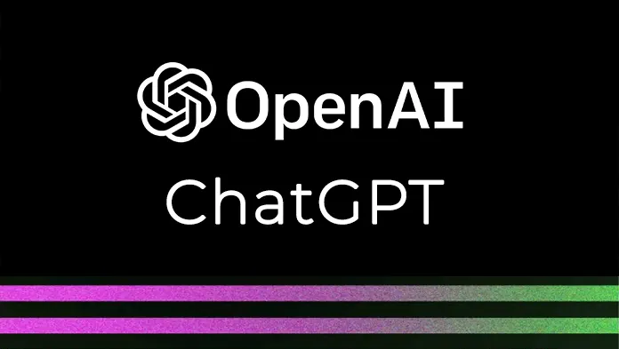

<p align="center">

</p>

# ChatGPT Clone

[](https://github.com/fadyehabamer/Chatgpt-Clone/actions/workflows/ci.yml)

A ChatGPT-style chat UI built with React, Vite and
[chat-ui-kit-react](https://github.com/chatscope/chat-ui-kit-react). Messages are
sent to a server-side `/api/chat` endpoint that calls the OpenAI API with the
official [`openai`](https://www.npmjs.com/package/openai) SDK, so your API key is
never shipped to the browser. The endpoint runs as a Vercel Function
(`api/chat.js`) in production and as a small Express server (`server/index.js`)
locally; both use the same request handling in `server/chat.js`.

## Requirements

- Node.js 22.12 or newer
- An OpenAI API key

## Setup

```sh
npm install
cp .env.example .env   # then put your key in OPENAI_API_KEY
```

| Variable         | Required | Description                                  |
| ---------------- | -------- | -------------------------------------------- |
| `OPENAI_API_KEY` | yes      | Your OpenAI API key (server-side only).      |
| `OPENAI_MODEL`   | no       | Model to use. Defaults to `gpt-5.5`.         |
| `PORT`           | no       | Port for the API server. Defaults to `3001`. |

Never commit `.env`; it is listed in `.gitignore`.

## Development

Run the API server and the Vite dev server in two terminals:

```sh
npm run server   # API on http://localhost:3001 (restarts on changes)
npm run dev      # UI on http://localhost:5173, proxies /api to the server
```

## Deploying to Vercel

The Vercel project uses the **Vite** framework preset. Vercel builds the UI into
`dist/` and deploys `api/chat.js` as a Node.js Vercel Function at `/api/chat`, so
no `vercel.json` is needed.

1. In the Vercel project, open **Settings → Environment Variables** and add:
   - `OPENAI_API_KEY`: your OpenAI key. Required. Add it to Production (and to
     Preview if you want preview deployments to answer chats).
   - `OPENAI_MODEL`: optional model override. Defaults to `gpt-5.5`.
2. Deploy (or merge to the production branch). Changes to environment variables
   only apply to new deployments, so redeploy if you add them afterwards.

Do not prefix these variables with `VITE_`. Only `VITE_*` variables are exposed
to the browser bundle. If `OPENAI_API_KEY` is missing, `/api/chat` returns a
`500` JSON error.

## Self-hosting with Node

```sh
npm run build    # outputs the UI to dist/
npm start        # serves dist/ and /api/chat from the same server
```

## Tests

```sh
npm test         # request validation and the /api/chat handler (OpenAI mocked)
```

## License

[MIT](LICENSE)
